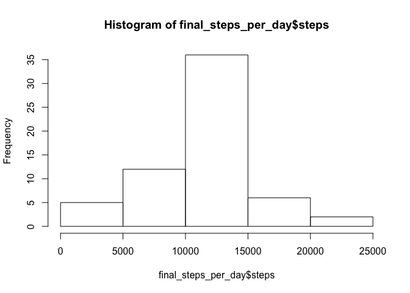

---
output:
  html_document:
    keep_md: true
---
Reproducible Research - Peer Assignment Tom Strouken
====================================================

This is my assignment for the Reproducible Research course of the Coursera Data Science Specialisation.

Download, unzip and explore the data
====================================================

First we're going to download and unzip the data


```r
Repdata_file <- "repdata_data_activity.zip"

if(!file.exists(Repdata_file)) {
RepdataURL <- "https://d396qusza40orc.cloudfront.net/repdata%2Fdata%2Factivity.zip"
download.file(url=RepdataURL,destfile=Repdata_file)
}
unzip("./repdata_data_activity.zip")
activity_steps_data <- read.csv("./activity.csv")
```

Let's have a quick exploration of the data


```r
summary(activity_steps_data) 
```

```
##      steps                date          interval     
##  Min.   :  0.00   2012-10-01:  288   Min.   :   0.0  
##  1st Qu.:  0.00   2012-10-02:  288   1st Qu.: 588.8  
##  Median :  0.00   2012-10-03:  288   Median :1177.5  
##  Mean   : 37.38   2012-10-04:  288   Mean   :1177.5  
##  3rd Qu.: 12.00   2012-10-05:  288   3rd Qu.:1766.2  
##  Max.   :806.00   2012-10-06:  288   Max.   :2355.0  
##  NA's   :2304     (Other)   :15840
```


```r
names(activity_steps_data)
```

```
## [1] "steps"    "date"     "interval"
```


```r
head(activity_steps_data)
```

```
##   steps       date interval
## 1    NA 2012-10-01        0
## 2    NA 2012-10-01        5
## 3    NA 2012-10-01       10
## 4    NA 2012-10-01       15
## 5    NA 2012-10-01       20
## 6    NA 2012-10-01       25
```


```r
pairs(activity_steps_data)
```

<!-- -->

What is mean total number of steps taken per day?
====================================================

1. Calculate the number of steps per date


```r
steps_per_day <- aggregate(steps ~ date, activity_steps_data, sum, na.rm=TRUE)
```

2. Make a histogram of the total number of steps taken each day


```r
hist(steps_per_day$steps,
     xlab="Steps",
     ylab="Frequency",
     main="Histogram steps taken each day")
```

<!-- -->

3. Calculate and report the mean and median of the total number of steps taken per day


```r
mean(steps_per_day$steps)
```

```
## [1] 10766.19
```


```r
median(steps_per_day$steps)
```

```
## [1] 10765
```


What is the average daily activity pattern?
====================================================

1. Make a time series plot (i.e. 𝚝𝚢𝚙𝚎 = “𝚕”) of the 5-minute interval (x-axis) and the average number of steps taken, averaged across all days (y-axis)


```r
steps_per_interval<-aggregate(steps~interval, data=activity_steps_data, mean, na.rm=TRUE)
plot(steps~interval,data=steps_per_interval,type="l",main = "Time series avarage steps of 5-minute interval")
```

<!-- -->

2. Which 5-minute interval, on average across all the days in the dataset, contains the maximum number of steps


```r
steps_per_interval[which.max(steps_per_interval$steps),]$interval
```

```
## [1] 835
```

Imputing missing values
====================================================

1. Calculate and report the total number of missing values in the dataset (i.e. the total number of rows with 𝙽𝙰s)


```r
sum(is.na(activity_steps_data$steps))
```

```
## [1] 2304
```

2. Devise a strategy for filling in all of the missing values in the dataset. 

We use a simple one: we fill in the NA's with the mean per interval.


```r
mean_per_interval<-function(interval){
    steps_per_interval[steps_per_interval$interval==interval,]$steps
}
```

3. Create a new dataset that is equal to the original dataset but with the missing data filled in.


```r
final_activity_steps_data <- activity_steps_data

for(i in 1:nrow(final_activity_steps_data)){
    if(is.na(final_activity_steps_data[i,]$steps)){
            final_activity_steps_data[i,]$steps <- mean_per_interval(final_activity_steps_data[i,]$interval)}
        }
```

4. Make a histogram of the total number of steps taken each day and Calculate and report the mean and median total number of steps taken per day. 


```r
final_steps_per_day <- aggregate(steps ~ date, data=final_activity_steps_data, sum)
hist(final_steps_per_day$steps)
```

<!-- -->


```r
mean(final_steps_per_day$steps)
```

```
## [1] 10766.19
```


```r
median(final_steps_per_day$steps)
```

```
## [1] 10766.19
```

Do these values differ from the estimates from the first part of the assignment? What is the impact of imputing missing data on the estimates of the total daily number of steps?

The mean stayed the same after the replacements of NAs, the median changed a little bit.

Are there differences in activity patterns between weekdays and weekends?
====================================================

1. Create a new factor variable in the dataset with two levels – “weekday” and “weekend” indicating whether a given date is a weekday or weekend day.


```r
final_activity_steps_data$date <- as.Date(strptime(final_activity_steps_data$date, format="%Y-%m-%d"))
final_activity_steps_data$day <- weekdays(final_activity_steps_data$date)

for (i in 1:nrow(final_activity_steps_data)) {
    if (final_activity_steps_data[i,]$day %in% c("Saturday","Sunday")) {
        final_activity_steps_data[i,]$day<-"weekend"
    }
    else{
        final_activity_steps_data[i,]$day<-"weekday"
    }
}
```

2. Make a panel plot containing a time series plot (i.e. 𝚝𝚢𝚙𝚎 = “𝚕”) of the 5-minute interval (x-axis) and the average number of steps taken, averaged across all weekday days or weekend days (y-axis).

```r
steps_by_day <- aggregate(final_activity_steps_data$steps ~ final_activity_steps_data$interval + final_activity_steps_data$day, final_activity_steps_data, mean)

names(steps_by_day) <- c("interval", "day", "steps")
library(lattice)
xyplot(steps ~ interval | day, steps_by_day, type = "l", layout = c(1, 2), 
    xlab = "Interval", ylab = "Number of steps")
```

<!-- -->
